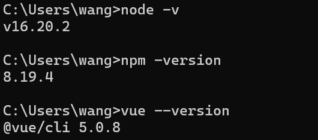

# AI开发教务管理系统

## 起因

### 原因

老师给我们布置大作业,于是我想到结合ai的方式进行开发

| Prompt                                                       | Image                                                        |
| ------------------------------------------------------------ | ------------------------------------------------------------ |
| 本课程期末考核采用大作业的形式，旨在考核同学们对重点知识内容的理解情况以及实践动手操作能力，同时考察同学们的编程思想和通过编程解决问题的能力，重点考察Spring框架技术和Mybatis框架技术，如控制反转的基本思想、依赖注入、面向切面编程、SpringMVC技术的应用、持久层设计和实现等。<br/>一、作业题目及要求如下<br/>1.作业的基本要求每位同学设计并实现一个基于SSM框架（Spring+SpringMVC+MyBatis）或SpringBoot的教务信息管理系统。<br/>2.技术要求：数据库最好为MySQL，也可以是其他关系型数据库，编程语言为Java，web服务器软件为Tomcat，必须使用Spring框架和Mybatis框架（允许使用SpringBoot）。<br/>3.工作量要求：该系统包含三个角色：老师，学生，管理员。管理员的业务有：<br/>（1）添加，删除，修改，查看学生的信息<br/>（2）添加，删除，修改，查看老师的信息<br/>（3）添加，删除，修改，查看管理员的信息<br/>（4）添加，删除，修改，查看课程的信息<br/>（5）登录<br/>老师的业务有：<br/>（1）登录<br/>（2）录入，修改，查看选了自己教的课程的学生的成绩信息<br/>（3）查看自己的个人信息，其中包括自己教的课程<br/>学生的业务有：<br/>（1）登录<br/>（2）选择课程<br/>（3）查看自己的个人信息，包括所选课程的成绩<br/>系统数据库的各个数据库表（老师表，学生表，管理员表等）的信息字段自行设计，但不能因为多字段或少字段影响上述功能。数据库对象（例如主键，外键等）的使用也是考察的重点。数据库表和字段的命名必须有意义，不能出现毫无意义的字段名或表名。<br/>系统的界面要求整洁美观，并且能清晰地展示信息。使用HTML+CSS+JavaScript结合JSP完成前端页面的设计和实现，也可以用其他高级前端技术实现。<br/>系统的后端要求代码结构合理，对应的方法和类有相应的注释，类名使用帕斯卡命名法，变量名和方法名用驼峰命名法，能够正确实现上文要求的业务。<br/>4.提交内容：使用金山表单在线提交作业，要求提交数据库脚本、源代码和系统运行讲解视频，具体内容见金山表单。<br/>二、考核时间安排<br/>2024年12月8日下午6点前完成大作业，提交到收作业的金山表单。<br/>三、考核说明<br/>要求同学开卷独立完成大作业，不得相互抄袭。否则，一旦发现全部按0分处理。逾期不交者，按缺考处理！！！<br/>四、评分标准<br/>1. 总成绩由平时成绩和大作业成绩组成，其中平时成绩占30％，平时成绩主要由学生平时考勤情况和课后作业完成情况组成，课程结束后缺勤次数少于总课时的三分之一，在确认无记录错误情况后，提醒学生确认其考勤情况，确认缺课次数达到总课时的三分之一后取消其考试成绩。<br/>2. 大作业成绩总分为100分，构成如下：<br/>1）使用HTML+CSS+JavaScript结合JSP完成前端页面的设计和实现，也可以用其他高级前端技术实现。（20分）<br/>2）使用SSM框架（Spring+SpringMVC+MyBatis）或SpringBoot实现后端。（60分）<br/>3）使用MySQL或其他关系型数据库完成数据库的设计和实现。（20分） |  |

### 选择

前提:发送同样的Prompt

| AI原型       | 优点                                                         | 缺点                                                   | 图片实例                                                     |
| ------------ | ------------------------------------------------------------ | ------------------------------------------------------ | ------------------------------------------------------------ |
| ChatGPT      | 有针对不同领域的机器人,生成步骤具体且整洁,是按阶段帮你实现,更像一个老师在一步一步教你,所以更适合用于交流 | 稳定性不足,可能是受限于文字长度,导致回答质量时好时坏   |  |
| Claude       | Code神器,直接生成代码,而且质量很高.                          | 对于问答,有时候会一直重复,还非常倔,让他改还不听话      |  |
| Gemini       | 动画不错,看着很流畅,发出来的话都是网上可以参考得到的,生成的话还有草稿,还是很不错的 | 创造性不行,不够灵活,我要问的详细一点才给出好一点的结果 |  |
| Bing copilot | 动画和界面是我最喜欢的一个,让我感觉很舒服,生成的内容还是中英文都有的,也是可以引用网上资料的 | 内容中规中矩,就是想找历史记录一开始没找到              |  |
|              | 有个指令中心,我不知道这么问的时候,可以在里面找,中文交流更适合交流,所以我还是喜欢把一些中文文档发给他,帮我讲解 | 写的内容有点简单,并不能很好的实现                      |  |
| 文心一言     | 表格化的不错,会先帮你整理内容,才能具体实现,有个百宝箱功能,可以切到更合适的场景 | 最傻的一个,可以更适合日常的交流                        |  |

### 结果

所以,综合来看,最后我选择了Claude,他的回答很符合我的要求,所以用来写Code,ChatGPT交流更顺畅,用来写文档

## 操作

### 第一步：基础环境搭建

#### 1. 配置开发环境

1. **开发工具**：本篇使用IDEA来开发后端,VSCode来开发前端。
2. **框架选择**：Spring Boot
3. **数据库**：使用 MySQL。
4. **服务器**：使用 Tomcat（ Spring Boot，可以直接内置 Tomcat）。

#### 2. 创建项目

##### 后端

- 如果使用的是 Spring Boot，可以通过 Spring Initializr 来生成项目。

  - >首先进入[Spring Initializr](https://start.spring.io/),然后按照图上的进行配置,依赖可以暂时不添加,如果你想用Java 8 的话还是建议你用IDE来创建  

- 如果使用的是 SSM，可以在 IDE 中手动创建项目结构，并添加所需依赖。

  - >把服务器URL换成 `https://start.aliyun.com/` 就可以使用Java 8 了
    >
    >
    >
    >同样的我们这里添加对应的 `Maven` 依赖,这个后续也可以在 `POM` 文件里加也行,之后创建就好
    >
    >

##### 前端

​	在开始之前,要确保自己有 `node` 和 `Vue` 的环境

```bash
node -v

npm -version

vue --version
```



​	有了环境后我们就可以开始创建`Vue`项目了,这里我们创建`Vue3`的项目

​	首先,我们要以管理员身份运行`cmd`


​	接着 `cd` 到项目里 

接着我们使用命令`vue create frontend`来创建项目


这里我们选最后一个


用空格来控制选择,选择图中内容即可


​	之后,我们选择`Vue3`

​	是否要保存为这个项目作为一个模板保存？我们输入`n`,然后回车


看到这个界面,说明我们的项目已经创建成功了,也可以在文件夹中看到,我们创建的项目,可以输入蓝色的命令,来启动项目,这里就不演示了.


#### 3. 项目结构

这里我们让AI为我们提供一个完整的教务管理系统项目结构的 tree 图:

```bash
education-system/
├── pom.xml
├── src/
│   ├── main/
│   │   ├── java/
│   │   │   └── com/
│   │   │       └── example/
│   │   │           └── education/
│   │   │               ├── EducationSystemApplication.java
│   │   │               ├── config/
│   │   │               │   ├── SecurityConfig.java
│   │   │               │   ├── JwtAuthenticationEntryPoint.java
│   │   │               │   └── JwtRequestFilter.java
│   │   │               ├── controller/
│   │   │               │   ├── AdminController.java
│   │   │               │   ├── TeacherController.java
│   │   │               │   ├── StudentController.java
│   │   │               │   ├── CourseController.java
│   │   │               │   └── CourseSelectionController.java
│   │   │               ├── entity/
│   │   │               │   ├── Admin.java
│   │   │               │   ├── Teacher.java
│   │   │               │   ├── Student.java
│   │   │               │   ├── Course.java
│   │   │               │   └── CourseSelection.java
│   │   │               ├── mapper/
│   │   │               │   ├── AdminMapper.java
│   │   │               │   ├── TeacherMapper.java
│   │   │               │   ├── StudentMapper.java
│   │   │               │   ├── CourseMapper.java
│   │   │               │   └── CourseSelectionMapper.java
│   │   │               ├── service/
│   │   │               │   ├── AdminService.java
│   │   │               │   ├── TeacherService.java
│   │   │               │   ├── StudentService.java
│   │   │               │   ├── CourseService.java
│   │   │               │   └── CourseSelectionService.java
│   │   │               ├── security/
│   │   │               │   ├── CustomUserDetailsService.java
│   │   │               │   └── JwtUtils.java
│   │   │               └── EducationSystemApplication.java
│   │   └── resources/
│   │       ├── application.properties
│   │       └── mapper/
│   │           ├── AdminMapper.xml
│   │           ├── TeacherMapper.xml
│   │           ├── StudentMapper.xml
│   │           ├── CourseMapper.xml
│   │           └── CourseSelectionMapper.xml
│   └── test/
│       └── java/
│           └── com/
│               └── example/
│                   └── education/
│                       └── EducationSystemApplicationTests.java
└── frontend/
    ├── package.json
    ├── src/
    │   ├── main.js
    │   ├── App.vue
    │   ├── router.js
    │   ├── store.js
    │   ├── components/
    │   │   ├── Navbar.vue
    │   │   ├── AdminDashboard.vue
    │   │   ├── TeacherDashboard.vue
    │   │   ├── StudentDashboard.vue
    │   │   ├── CourseList.vue
    │   │   └── CourseSelection.vue
    │   └── views/
    │       ├── Login.vue
    │       ├── Register.vue
    │       ├── AdminPanel.vue
    │       ├── TeacherPanel.vue
    │       └── StudentPanel.vue
    └── public/
        ├── index.html
        └── favicon.ico
```

那么我们也就照着这个结构来创建文件

| 前端                                                         | 后端                                                         |
| ------------------------------------------------------------ | ------------------------------------------------------------ |
|  |  |

#### 4. 设计数据库

我们打开 `Navicat` 点击新建查询,然后将代码进去,点击运行,刷新后,表格就生成好了


#### 5. 添加依赖

将依赖添加到 `pom.xml` ,你也可以直接全部复制粘贴

```xml
<?xml version="1.0" encoding="UTF-8"?>
<project xmlns="http://maven.apache.org/POM/4.0.0" xmlns:xsi="http://www.w3.org/2001/XMLSchema-instance"
         xsi:schemaLocation="http://maven.apache.org/POM/4.0.0 https://maven.apache.org/xsd/maven-4.0.0.xsd">
    <modelVersion>4.0.0</modelVersion>
    <groupId>com.example</groupId>
    <artifactId>education_system</artifactId>
    <version>0.0.1-SNAPSHOT</version>
    <name>education_system</name>
    <description>education_system</description>
    <properties>
        <java.version>1.8</java.version>
        <project.build.sourceEncoding>UTF-8</project.build.sourceEncoding>
        <project.reporting.outputEncoding>UTF-8</project.reporting.outputEncoding>
        <spring-boot.version>2.6.13</spring-boot.version>
    </properties>
    <dependencies>
        <dependency>
            <groupId>org.springframework.boot</groupId>
            <artifactId>spring-boot-starter-security</artifactId>
        </dependency>
        <dependency>
            <groupId>org.springframework.boot</groupId>
            <artifactId>spring-boot-starter-validation</artifactId>
        </dependency>
        <dependency>
            <groupId>org.springframework.boot</groupId>
            <artifactId>spring-boot-starter-web</artifactId>
        </dependency>
        <dependency>
            <groupId>org.mybatis.spring.boot</groupId>
            <artifactId>mybatis-spring-boot-starter</artifactId>
            <version>2.2.2</version>
        </dependency>

        <dependency>
            <groupId>com.mysql</groupId>
            <artifactId>mysql-connector-j</artifactId>
            <scope>runtime</scope>
        </dependency>
        <dependency>
            <groupId>org.projectlombok</groupId>
            <artifactId>lombok</artifactId>
            <optional>true</optional>
        </dependency>
        <dependency>
            <groupId>org.springframework.boot</groupId>
            <artifactId>spring-boot-starter-test</artifactId>
            <scope>test</scope>
        </dependency>
        <dependency>
            <groupId>org.springframework.security</groupId>
            <artifactId>spring-security-test</artifactId>
            <scope>test</scope>
        </dependency>
    </dependencies>
    <dependencyManagement>
        <dependencies>
            <dependency>
                <groupId>org.springframework.boot</groupId>
                <artifactId>spring-boot-dependencies</artifactId>
                <version>${spring-boot.version}</version>
                <type>pom</type>
                <scope>import</scope>
            </dependency>
        </dependencies>
    </dependencyManagement>

    <build>
        <plugins>
            <plugin>
                <groupId>org.apache.maven.plugins</groupId>
                <artifactId>maven-compiler-plugin</artifactId>
                <version>3.8.1</version>
                <configuration>
                    <source>1.8</source>
                    <target>1.8</target>
                    <encoding>UTF-8</encoding>
                </configuration>
            </plugin>
            <plugin>
                <groupId>org.springframework.boot</groupId>
                <artifactId>spring-boot-maven-plugin</artifactId>
                <version>${spring-boot.version}</version>
                <configuration>
                    <mainClass>com.example.education_system.EducationSystemApplication</mainClass>
                    <skip>true</skip>
                </configuration>
                <executions>
                    <execution>
                        <id>repackage</id>
                        <goals>
                            <goal>repackage</goal>
                        </goals>
                    </execution>
                </executions>
            </plugin>
        </plugins>
    </build>

</project>
```

添加完成后,记得更新


#### 6. 配置Spring boot文件

我们找到 `application.properties` 文件,配置Spring boot

```properties
# 服务器配置
server.port=8080
server.servlet.context-path=/api

# 数据库配置
spring.datasource.driver-class-name=com.mysql.cj.jdbc.Driver
spring.datasource.url=jdbc:mysql://localhost:3306/education_system?useUnicode=true&characterEncoding=utf-8&serverTimezone=Asia/Shanghai
spring.datasource.username=root
spring.datasource.password=root

# MyBatis配置
mybatis.mapper-locations=classpath:mapper/*.xml
mybatis.type-aliases-package=com.example.education.entity
mybatis.configuration.map-underscore-to-camel-case=true

# JWT配置
jwt.secret=your-secret-key
jwt.expiration=86400000

# 日志配置
logging.level.com.example.education=debug
```


