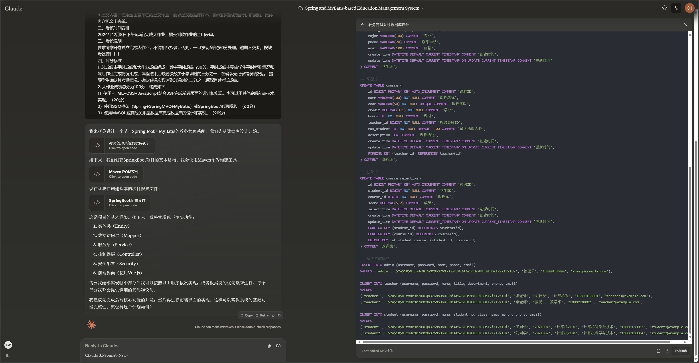

# AI开发教务管理系统

## 起因

老师给我们布置大作业,于是我想到结合ai的方式进行开发

| Prompt                                                       | Image                                                        |
| ------------------------------------------------------------ | ------------------------------------------------------------ |
| 本课程期末考核采用大作业的形式，旨在考核同学们对重点知识内容的理解情况以及实践动手操作能力，同时考察同学们的编程思想和通过编程解决问题的能力，重点考察Spring框架技术和Mybatis框架技术，如控制反转的基本思想、依赖注入、面向切面编程、SpringMVC技术的应用、持久层设计和实现等。 一、作业题目及要求如下 1.作业的基本要求每位同学设计并实现一个基于SSM框架（Spring+SpringMVC+MyBatis）或SpringBoot的教务信息管理系统。 2.技术要求：数据库最好为MySQL，也可以是其他关系型数据库，编程语言为Java，web服务器软件为Tomcat，必须使用Spring框架和Mybatis框架（允许使用SpringBoot）。 3.工作量要求：该系统包含三个角色：老师，学生，管理员。管理员的业务有： （1）添加，删除，修改，查看学生的信息 （2）添加，删除，修改，查看老师的信息 （3）添加，删除，修改，查看管理员的信息 （4）添加，删除，修改，查看课程的信息 （5）登录 老师的业务有： （1）登录 （2）录入，修改，查看选了自己教的课程的学生的成绩信息 （3）查看自己的个人信息，其中包括自己教的课程 学生的业务有： （1）登录 （2）选择课程 （3）查看自己的个人信息，包括所选课程的成绩 系统数据库的各个数据库表（老师表，学生表，管理员表等）的信息字段自行设计，但不能因为多字段或少字段影响上述功能。数据库对象（例如主键，外键等）的使用也是考察的重点。数据库表和字段的命名必须有意义，不能出现毫无意义的字段名或表名。 系统的界面要求整洁美观，并且能清晰地展示信息。使用HTML+CSS+JavaScript结合JSP完成前端页面的设计和实现，也可以用其他高级前端技术实现。 系统的后端要求代码结构合理，对应的方法和类有相应的注释，类名使用帕斯卡命名法，变量名和方法名用驼峰命名法，能够正确实现上文要求的业务。 4.提交内容：使用金山表单在线提交作业，要求提交数据库脚本、源代码和系统运行讲解视频，具体内容见金山表单。 二、考核时间安排 2024年12月8日下午6点前完成大作业，提交到收作业的金山表单。 三、考核说明 要求同学开卷独立完成大作业，不得相互抄袭。否则，一旦发现全部按0分处理。逾期不交者，按缺考处理！！！ 四、评分标准 1. 总成绩由平时成绩和大作业成绩组成，其中平时成绩占30％，平时成绩主要由学生平时考勤情况和课后作业完成情况组成，课程结束后缺勤次数少于总课时的三分之一，在确认无记录错误情况后，提醒学生确认其考勤情况，确认缺课次数达到总课时的三分之一后取消其考试成绩。 2. 大作业成绩总分为100分，构成如下： 1）使用HTML+CSS+JavaScript结合JSP完成前端页面的设计和实现，也可以用其他高级前端技术实现。（20分） 2）使用SSM框架（Spring+SpringMVC+MyBatis）或SpringBoot实现后端。（60分） 3）使用MySQL或其他关系型数据库完成数据库的设计和实现。（20分） |  |

前提:发送同样的Prompt

| AI原型  | 优点                                                         | 缺点                                                 | 描述                                                         | 图片实例 |
| ------- | ------------------------------------------------------------ | ---------------------------------------------------- | ------------------------------------------------------------ | -------- |
| ChatGPT | 有针对不同领域的机器人,生成步骤具体且整洁,是按阶段帮你实现,更像一个老师在一步一步教你 | 稳定性不足,可能是受限于文字长度,导致回答质量时好时坏 | 我是用的是`DesignerGPT`机器人,直接发送Prompt后,他会先给你总结,所以要继续追问才会给你想要的结果. |          |
|         |                                                              |                                                      |                                                              |          |

