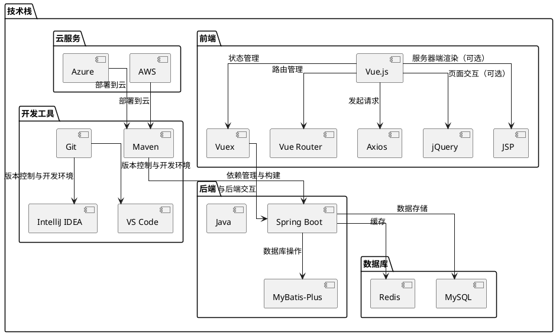
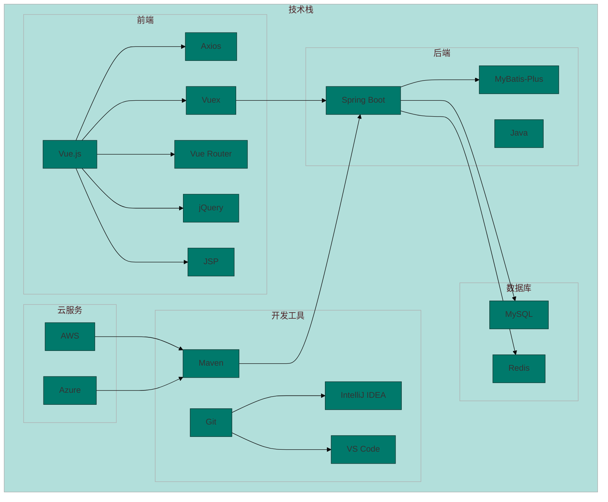

# test

## tabs

```markdown
<!-- tabs:start -->

#### **English**

Hello!

#### **French**

Bonjour!

#### **Italian**

Ciao!

<!-- tabs:end -->
```

plantuml绘图



mermaid绘图




### Here are some of your previous markdown contents


> [!NOTE]
>
> 翻页
>
> tab


### gif图片使用

```pdf
https://gbodigital.github.io/docsify-gifcontrol/#/
```


### Q&A

# FAQ Section

Introduction text for the FAQ page.

+ 这是什么 +

  blog

+ 这是什么 +

  blog


### HTML Preview

```html preview
<p>Hello, World.</p>
```

